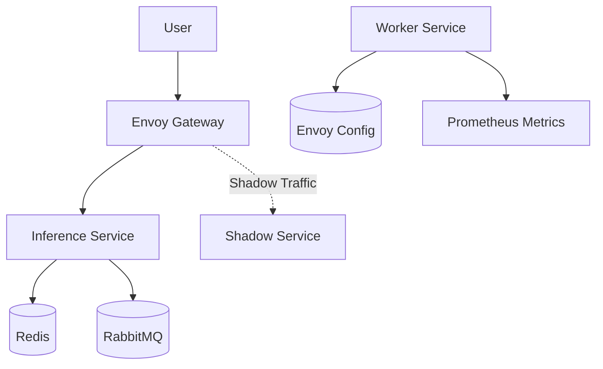

# MLOps Engine

A refactored MLOps Kubernetes and Python codebase with enhanced security, hardening, and observability.

## Architecture

The system consists of an inference service (baseline) and a worker service, with Envoy acting as a gateway/proxy.



## Refactoring Changes

### Security & Hardening
- **Least Privilege RBAC**: The worker Role is now restricted to specific ConfigMap resources using `resourceNames`.
- **Secret Management**: Redis and RabbitMQ URLs are moved from plain text `values.yaml` to Kubernetes Secrets.
- **Read-Only Filesystem**: Both Inference and Worker deployments now run with `readOnlyRootFilesystem: true`.
- **Temporary Storage**: Added `emptyDir` volumes mounted at `/tmp` to support applications requiring temporary write access.
- **Envoy Hardening**: Restricted the Envoy admin interface to `127.0.0.1` to prevent external access.
- **Persistence**: Removed insecure `hostPath` options in favor of managed storage like EFS.

### Observability
- **Structured Logging**: `worker/metrics.py` now uses JSON-formatted structured logging for better log aggregation.
- **Specific Error Handling**: Replaced bare `except` blocks with specific exception types and error logging.
- **Prometheus Best Practices**: All Prometheus metric labels are now passed as keyword arguments for better clarity and maintainability.

### Flexibility
- **Parameterized Shadow Traffic**: The Envoy request mirror policy numerator is now a Helm variable (`envoy.shadowTrafficNumerator`), allowing easy adjustment of shadow traffic percentages.

## Setup & Installation

1. **Configure Secrets**: Update the `secrets` section in `values.yaml` with your actual Redis and RabbitMQ URLs.
2. **Deploy with Helm**:
   ```bash
   helm install mlops-engine ./mlops-engine
   ```
3. **Adjust Shadow Traffic**:
   ```bash
   helm upgrade mlops-engine ./mlops-engine --set envoy.shadowTrafficNumerator=20
   ```

## License

This project is licensed under the terms of the GNU Affero General Public License version 3 (AGPLv3). See the [LICENSE](LICENSE) file for the full text.
