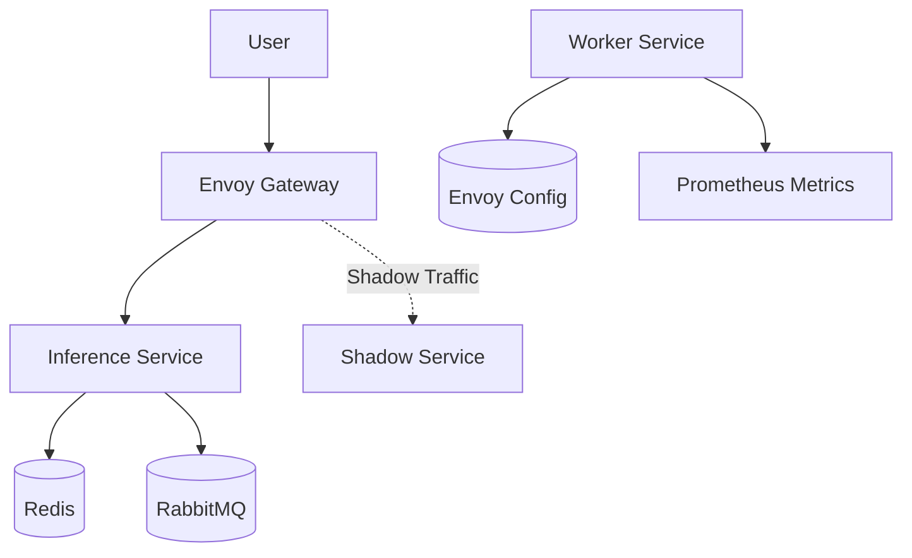

# MLOps Engine

A refactored MLOps Kubernetes and Python codebase with enhanced security, hardening, and observability.

## Architecture

The system consists of an inference service (baseline) and a worker service, with Envoy acting as a gateway/proxy.



## Refactoring Changes

### Security & Hardening
- **Least Privilege RBAC**: The worker Role is now restricted to specific ConfigMap resources using `resourceNames`.
- **Secret Management**: Redis and RabbitMQ URLs are moved from plain text `values.yaml` to Kubernetes Secrets.
- **Read-Only Filesystem**: Both Inference and Worker deployments now run with `readOnlyRootFilesystem: true`.
- **Temporary Storage**: Added `emptyDir` volumes mounted at `/tmp` to support applications requiring temporary write access.
- **Envoy Hardening**: Restricted the Envoy admin interface to `127.0.0.1` to prevent external access.
- **Persistence**: Removed insecure `hostPath` options in favor of managed storage like EFS.

### Observability
- **Structured Logging**: `worker/metrics.py` now uses JSON-formatted structured logging for better log aggregation.
- **Specific Error Handling**: Replaced bare `except` blocks with specific exception types and error logging.
- **Prometheus Best Practices**: All Prometheus metric labels are now passed as keyword arguments for better clarity and maintainability.

### Flexibility
- **Parameterized Shadow Traffic**: The Envoy request mirror policy numerator is now a Helm variable (`envoy.shadowTrafficNumerator`), allowing easy adjustment of shadow traffic percentages.

## Drift Monitoring

The MLOps Engine implements a multi-layered approach to detecting and managing data drift:

1. **Population Stability Index (PSI)**: We calculate PSI per feature to monitor changes in the distribution of incoming data compared to the training baseline.
2. **Adversarial Validation AUC**: A binary classifier is trained to distinguish between training data and production data. An AUC-ROC significantly above 0.5 indicates a clear distinction (drift) between the two sets.
3. **Elastic Weight Consolidation (EWC)**: To prevent "catastrophic forgetting" during automated retraining, we use EWC to preserve performance on previous tasks while adapting to new data patterns.

## Operational Edge Cases

### Zero-Downtime Hot-Swaps
When a new model is deployed, Envoy performs a graceful hot-swap. In-flight requests are allowed to complete using the old model context, while new requests are immediately routed to the new version. Envoy manages connection draining to ensure no requests are dropped during the transition.

### Worker Queue Safeguards
To prevent system instability during drift-induced retraining surges:
- **Rate Limiting**: The RabbitMQ setup includes consumer concurrency limits to prevent worker starvation.
- **Memory Pressure Management**: The worker service uses a bounded queue and prioritizes tasks to prevent memory exhaustion during peak loads.

## Setup & Installation

1. **Configure Secrets**: Update the `secrets` section in `values.yaml` with your actual Redis and RabbitMQ URLs.
2. **Deploy with Helm**:
   ```bash
   helm install mlops-engine ./mlops-engine
   ```
3. **Adjust Shadow Traffic**:
   ```bash
   helm upgrade mlops-engine ./mlops-engine --set envoy.shadowTrafficNumerator=20
   ```

## License

This project is dual-licensed under the terms of the GNU Affero General Public License version 3 (AGPLv3) and the Apache License version 2.0.

- For the AGPLv3 terms, see the [LICENSE](LICENSE) file.
- For the Apache 2.0 terms, see the [LICENSE-APACHE](LICENSE-APACHE) file.
